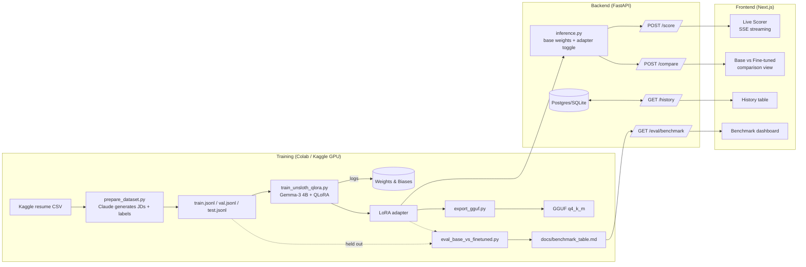

# Resume/JD Relevance Scorer

A small open-weight LLM (Gemma-3 4B), fine-tuned with QLoRA to score how well a resume
matches a job description — and a web app that proves the fine-tune actually helped,
instead of just claiming it.

> **Live demo:** _not deployed yet — see [Deployment](#deployment)_
> **Demo walkthrough:** _add a 60-90s GIF/video here once the app is deployed_

## The result (fill in after training)

The full table lives at [`docs/benchmark_table.md`](docs/benchmark_table.md), generated by
`training/eval_base_vs_finetuned.py` on a held-out test split. Summary:

| Approach | Pearson r | MAE | Latency (s) |
|---|---|---|---|
| Base model, zero-shot | — | — | — |
| Base model, few-shot | — | — | — |
| **Fine-tuned (QLoRA)** | — | — | — |

*(Run the training pipeline once to fill this in — see [Reproduce](#reproduce) below.)*

---

## Why this exists

Prompting a general model to "score this resume" is a wrapper around an API call. Fine-tuning
is a different skill: preparing training data, running QLoRA on a quantized model, and
*measuring* whether the specialized model actually beats the generic one — on cost, latency,
and quality. This project is built to make that comparison visible, not just assert it.

## Architecture



## Tech stack

| Layer | Choice |
|---|---|
| Fine-tuning | Unsloth + QLoRA (4-bit) on Gemma-3 4B-it |
| Training tracking | Weights & Biases |
| Inference | Unsloth fast inference (GPU) with a GGUF/llama.cpp/Ollama fallback (CPU) |
| Backend | FastAPI, SQLAlchemy, SSE streaming |
| Frontend | Next.js (App Router), TypeScript, Tailwind, shadcn/ui, recharts |
| DB | Postgres (Docker Compose) / SQLite (local dev) |
| Deployment | Docker Compose locally; Hugging Face Spaces or Modal for the model, Vercel for the frontend |

## Repo structure

```
training/
  prepare_dataset.py       # resumes + Claude-generated JDs/labels -> instruction-tuning JSONL
  train_unsloth_qlora.py   # QLoRA fine-tune, Unsloth + W&B
  eval_base_vs_finetuned.py# base zero-shot vs few-shot vs fine-tuned, on held-out test set
  export_gguf.py           # merged model -> GGUF for llama.cpp/Ollama
backend/
  app/main.py, routers/{score,compare,history,eval}.py
  app/models/inference.py  # loads base+adapter once; mock/transformers/ollama backends
  app/db/                  # SQLAlchemy models + schemas
frontend/
  app/{page,compare,benchmark,history}.tsx
docs/
  benchmark_table.md
docker-compose.yml
```

## Reproduce

### 1. Dataset

```bash
pip install -r training/requirements.txt
# Download the Kaggle "Resume Dataset": https://www.kaggle.com/datasets/snehaanbhawal/resume-dataset
kaggle datasets download -d snehaanbhawal/resume-dataset -p data/raw --unzip

export ANTHROPIC_API_KEY=...
python training/prepare_dataset.py --input data/raw/Resume.csv --n 900
# -> data/processed/{train,val,test}.jsonl  (~1800 examples: 2 per resume)
```

### 2. Train (Google Colab, free T4)

1. Open a new Colab notebook, select a T4 GPU runtime.
2. `!pip install -r requirements.txt` (upload `training/requirements.txt`), or install the
   packages listed in it directly.
3. Upload `data/processed/{train,val}.jsonl` and `training/train_unsloth_qlora.py`.
4. Set `WANDB_API_KEY` and `HF_TOKEN` (Gemma-3 is gated — accept the license on the Hub first).
5. `!python train_unsloth_qlora.py`
6. Download `outputs/adapter/` and `outputs/merged/` back to the repo.

### 3. Evaluate

```bash
cd training
python eval_base_vs_finetuned.py --adapter_dir ../outputs/adapter
# writes ../docs/benchmark_results.json and ../docs/benchmark_table.md
```

### 4. Run the app locally

```bash
docker compose up --build
# backend:  http://localhost:8000  (docs at /docs)
# frontend: http://localhost:3000
```

By default `MODEL_BACKEND=mock`, so the full app runs without a GPU or trained weights —
useful for developing the UI. Point it at real weights:

```bash
# GPU box with the trained adapter:
MODEL_BACKEND=transformers docker compose up --build

# CPU-friendly, via a GGUF export served by Ollama:
python training/export_gguf.py
ollama create resume-jd-scorer -f outputs/gguf/Modelfile
MODEL_BACKEND=ollama docker compose up --build
```

See `backend/.env.example` for all config options.

## Dataset & labeling honesty

Labels are **synthetic**: Claude generates a plausible job description for each real resume
(one "matching," one "mismatched," to spread the score distribution), then Claude grades the
pair 0-100 with a rationale. That means:

- The dataset teaches the small model to imitate *Claude's judgment* of resume/JD fit, not
  verified hiring outcomes or real recruiter labels.
- It's a legitimate way to prove the fine-tuning mechanics work and to measure a small model
  matching/approaching a much larger one's judgment on a narrow task — it is not evidence the
  scores are correct in an absolute, real-world-hiring sense.
- The honest framing in an interview: "I used an LLM-as-labeler because collecting real
  recruiter labels at this scale wasn't feasible solo. The benchmark measures whether the
  fine-tune faithfully specializes toward that labeling signal, cheaper and faster than
  prompting the larger model at inference time — not whether the labels are ground truth."

## Deployment

1. **Backend + model**: deploy `backend/` to Hugging Face Spaces (Docker SDK) or Modal — both
   have GPU tiers cheap enough for a 4B model. Set `MODEL_BACKEND=transformers` (or `ollama`
   if using the GGUF export) and the model/adapter paths as environment variables/secrets.
2. **Frontend**: deploy `frontend/` to Vercel, set `NEXT_PUBLIC_API_URL` to the backend's
   public URL.
3. Put the live URL, a demo GIF, and the benchmark table at the top of this README.

## What I'd do differently with more data/compute

- Real recruiter labels (even a few hundred) blended with the synthetic set, to sanity-check
  whether Claude's judgments and human judgments actually agree.
- A larger held-out test set — 10% of ~1,800 examples gives noisy correlation estimates.
- Try full fine-tuning or a larger LoRA rank on more compute, to see where the quality/cost
  curve actually bends for this task.

## License

Code in this repo: MIT (see [`LICENSE`](LICENSE)). Gemma-3 weights/adapters are governed by
Google's [Gemma Terms of Use](https://ai.google.dev/gemma/terms) — review the Prohibited Use
Policy before redistributing any exported model.
