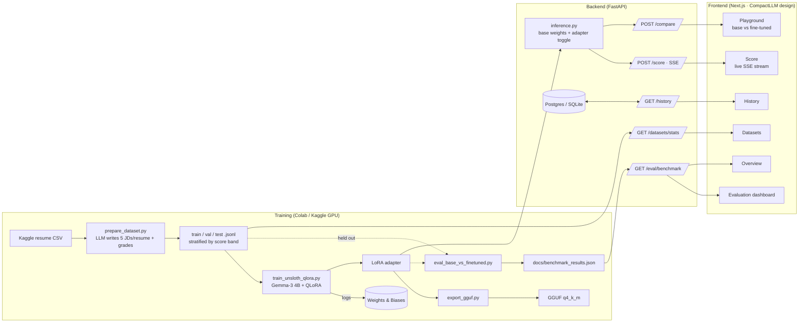

# CompactLLM — Resume/JD Relevance Scorer

A small open-weight LLM (Gemma-3 4B), fine-tuned with QLoRA to score how well a resume
matches a job description — wrapped in a web app that *proves* the fine-tune helped
instead of just claiming it.

> **Live demo:** _not deployed yet — see [Deployment](#deployment)_
> **Demo walkthrough:** _add a 60–90s GIF here once the app is deployed_

## The result (fill in after training)

Generated by `training/eval_base_vs_finetuned.py` on the held-out test split and served
at `/eval/benchmark` → the **Evaluation** page.

| Approach | Pearson r | MAE | Latency (s) |
|---|---|---|---|
| Base model, zero-shot | — | — | — |
| Base model, few-shot | — | — | — |
| **Fine-tuned (QLoRA)** | — | — | — |

*(Run the pipeline once to fill this in — see [Reproduce](#reproduce).)*

---

## Why this exists

Prompting a general model to "score this resume" is a wrapper around an API call.
Fine-tuning is a different skill: preparing training data, running QLoRA on a quantized
model, and *measuring* whether the specialized model actually beats the generic one — on
cost, latency, and quality. This project makes that comparison visible.

## Architecture



## Tech stack

| Layer | Choice |
|---|---|
| Fine-tuning | Unsloth + QLoRA (4-bit) on Gemma-3 4B-it |
| Training tracking | Weights & Biases |
| Inference | Unsloth fast inference (GPU); GGUF/llama.cpp/Ollama fallback (CPU); deterministic `mock` backend for weights-free demos |
| Backend | FastAPI, SQLAlchemy, SSE streaming |
| Frontend | Next.js (App Router), TypeScript, Tailwind v4, shadcn/ui, Recharts — CompactLLM design system (dark-first, Inter + JetBrains Mono) |
| DB | Postgres (Docker Compose) / SQLite (local dev) |
| Deployment | Docker Compose locally; Hugging Face Spaces (backend), Vercel (frontend) |

## Repo structure

```
training/
  prepare_dataset.py        # resumes -> 5 LLM JDs/resume + grades -> stratified JSONL
  train_unsloth_qlora.py    # QLoRA fine-tune, Unsloth + W&B
  eval_base_vs_finetuned.py # base zero-shot vs few-shot vs fine-tuned, held-out test set
  export_gguf.py            # merged model -> GGUF for llama.cpp/Ollama
backend/
  app/main.py, routers/{score,compare,history,eval,datasets}.py
  app/models/inference.py   # loads base+adapter once; mock/transformers/ollama backends
  app/db/                   # SQLAlchemy models + schemas
  README.md                 # Hugging Face Spaces frontmatter + deploy recipe
frontend/
  app/{page,score,playground,evaluation,datasets,history}/  # one route each
  components/{app-shell,sidebar,topbar,mobile-nav,page-primitives}.tsx
  lib/{api,examples,nav}.ts
docs/benchmark_table.md
docker-compose.yml
```

## Reproduce

### 1. Dataset

```bash
pip install -r training/requirements.txt
# Kaggle "Resume Dataset": https://www.kaggle.com/datasets/snehaanbhawal/resume-dataset
kaggle datasets download -d snehaanbhawal/resume-dataset -p data/raw --unzip

# A free labeling-oracle key in training/.env -- one of:
#   CEREBRAS_API_KEY   https://cloud.cerebras.ai
#   GROQ_API_KEY       https://console.groq.com/keys
#   GEMINI_API_KEY     https://aistudio.google.com/apikey  (classic AIza keys only)
echo "GROQ_API_KEY=..." > training/.env
python training/prepare_dataset.py --input data/raw/Resume.csv --resumes 120
# -> data/processed/{train,val,test}.jsonl  (~600 examples: 5 fit modes per resume,
#    stratified by score band). Resumable; self-paces against free-tier rate limits.
```

**Current checkpoint.** The version in `data/raw/generation_checkpoint.jsonl`
(700 examples) predates the 5-mode design — it used a matching-vs-mismatched
two-way split, so the label distribution is **bimodal** (clusters near 0 and
near 90, ~1% in between). It's re-split stratified so train/val/test are each
~50/50 low/high:

```bash
python training/prepare_dataset.py --resplit \
  --checkpoint data/raw/generation_checkpoint.jsonl --out_dir data/processed
```

Regenerating with the current 5-mode script is the fix for the missing middle
— it just needs a working oracle key (see above).

### 2. Train + evaluate (Google Colab, free T4)

Open [`training/train_colab.ipynb`](training/train_colab.ipynb) in Colab
([open in Colab](https://colab.research.google.com/github/aayush-arya/compact-llm/blob/main/training/train_colab.ipynb)),
set the runtime to **T4 GPU**, add `HF_TOKEN` as a Colab secret (accept the
[Gemma-3 license](https://huggingface.co/google/gemma-3-4b-it) first), then
**Run all**. It trains, evaluates against the base model, and hands you a zip
with `outputs/adapter`, `outputs/merged`, and `docs/benchmark_results.json`.

Optional secrets: `WANDB_API_KEY` (loss curves), `GROQ_API_KEY` (the eval
rationale judge — otherwise `rationale_quality` is reported as null).

To run the pieces by hand instead:

```bash
python training/train_unsloth_qlora.py            # -> outputs/adapter, outputs/merged
python training/eval_base_vs_finetuned.py         # -> docs/benchmark_results.json (+ .md)
# both run from the repo root; benchmark_results.json is what /eval/benchmark serves
```

### 3. Run the app locally

```bash
docker compose up --build
# backend:  http://localhost:8000  (docs at /docs)
# frontend: http://localhost:3000
```

Or without Docker:

```bash
# backend
cd backend && pip install -r requirements.txt && uvicorn app.main:app --reload
# frontend (another terminal)
cd frontend && npm install && npm run dev
```

`MODEL_BACKEND=mock` by default — the full app runs with no GPU or trained weights (a
deterministic heuristic scorer stands in, clearly labelled in the UI). Point it at real
weights:

```bash
MODEL_BACKEND=transformers docker compose up --build        # GPU box + trained adapter

python training/export_gguf.py                              # CPU-friendly, via Ollama
ollama create resume-jd-scorer -f outputs/gguf/Modelfile
MODEL_BACKEND=ollama docker compose up --build
```

See [`backend/.env.example`](backend/.env.example) for all config.

## Dataset & labeling honesty

Labels are **synthetic**. For each real resume, a large instruction model
(Llama-3.3-70B via Cerebras/Groq, or Gemini) writes five job descriptions spanning the
fit spectrum — strong / solid / partial / weak / mismatch — then grades each (resume, JD)
pair 0–100 with a rationale, judging only on evidence in the resume. That means:

- The dataset teaches the small model to imitate *the oracle model's judgment* of
  resume/JD fit, not verified hiring outcomes or real recruiter labels.
- It's a legitimate way to prove the fine-tuning mechanics work and to measure a small
  model approaching a much larger one's judgment on a narrow task — not evidence the
  scores are correct in an absolute, real-world-hiring sense.
- Interview framing: "I used an LLM-as-labeler because collecting real recruiter labels
  at this scale wasn't feasible solo. The benchmark measures whether the fine-tune
  faithfully specializes toward that labeling signal — cheaper and faster than prompting
  the larger model at inference — not whether the labels are ground truth."

The checkpointed dataset is also **bimodal** (see [Reproduce](#reproduce)): it was
built before the five-mode design, so it's mostly clear matches and clear mismatches.
That makes the correlation numbers read as "can it separate obvious fits from obvious
misfits" rather than "can it grade partial fits" — MAE and the base-vs-fine-tuned delta
are still meaningful, the correlation is just easier than it would be on a smooth
distribution. Regenerating with the current script closes that gap.

The **Datasets** page shows the live score distribution so this is visible, not buried.

## Deployment

**Backend → Hugging Face Spaces (Docker SDK).** [`backend/README.md`](backend/README.md)
carries the Space frontmatter. From the repo root:

```bash
git remote add space https://huggingface.co/spaces/<user>/compactllm-backend
git subtree push --prefix backend space main
```

Set `MODEL_BACKEND`, `CORS_ORIGINS` (your Vercel URL), and `DATABASE_URL` as Space
variables. For a real model, also deploy the adapter and set the `transformers`/`ollama`
paths; for a weights-free demo, `MODEL_BACKEND=mock` is enough.

**Frontend → Vercel.** Import the repo, set **Root Directory = `frontend`**, and set
`NEXT_PUBLIC_API_URL` to the Space's URL. [`frontend/vercel.json`](frontend/vercel.json)
pins the rest.

Then put the live URL, a demo GIF, and the benchmark table at the top of this README.

## What I'd do differently with more data/compute

- Real recruiter labels (even a few hundred) blended in, to check whether the oracle's
  judgments and human judgments actually agree.
- A larger held-out test set — 10% of ~600 examples gives noisy correlation estimates.
- Full fine-tuning or a larger LoRA rank on more compute, to see where the quality/cost
  curve bends for this task.

## License

Code: MIT (see [`LICENSE`](LICENSE)). Gemma-3 weights/adapters are governed by Google's
[Gemma Terms of Use](https://ai.google.dev/gemma/terms) — review the Prohibited Use
Policy before redistributing any exported model.
